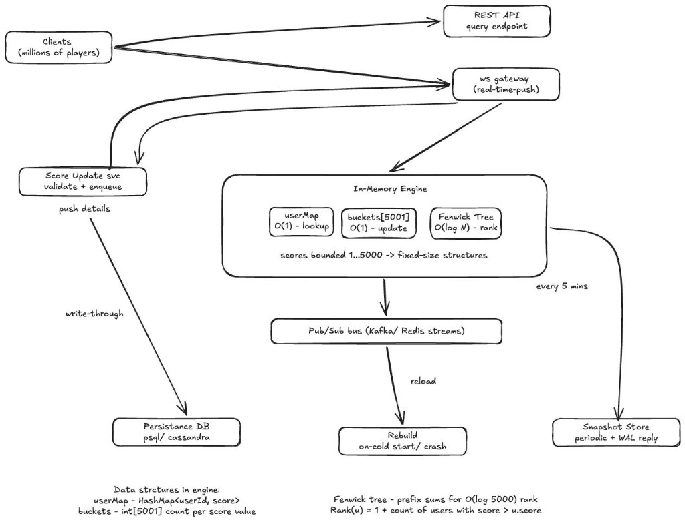

# Leaderboard & Ranking API

A **high-performance leaderboard service** implemented in two stacks so you can compare trade-offs: **Redis-backed** (Python and Go) for shared state and persistence, and **in-memory Fenwick tree** (Go) for lowest latency. The repo includes a single **latency report** (HTML) that compares all implementations with charts and % improvement tables—useful for design decisions and investor-style summaries.

**What you get:**

- **Same REST API** in three runnable forms: Python (FastAPI) + Redis, Go (Gin) + Redis, and Go in-memory (Fenwick). Optionally benchmark the Fenwick logic **without HTTP** via a direct-call runner.
- **Time and space complexity** notes and **100M-user** scaling guidance for both approaches.
- **One-command run**: `make report` brings up Docker (Redis + all three APIs), runs all latency tests, writes `latency_report.html`, then tears down.

---

## Quick start

**Run everything (APIs + all latency tests, then stop):**

```bash
make report
```

Then open **`latency_report.html`** in a browser to see latency tables, comparison chart, and % improvement by endpoint.

**Or run only the APIs** and explore manually:

```bash
docker compose up -d --build
```

| Service              | URL                                                      |
| -------------------- | -------------------------------------------------------- |
| Redis                | `localhost:6379`                                         |
| Python API (FastAPI) | http://localhost:8000 (docs: http://localhost:8000/docs) |
| Go API (Redis)       | http://localhost:8080                                    |
| Go API (In-memory)   | http://localhost:8081                                    |

Try: `curl http://localhost:8000/ping` or open the Python docs URL for interactive API exploration.

---

## Architecture

The diagram below describes a production-style scoring engine for **millions of players**: clients talk to a **score-update service** (validation + enqueue) and to **REST/WebSocket** for queries; an **in-memory engine** (userMap O(1), score buckets O(1), Fenwick tree O(log 5000) rank) keeps reads/writes fast; **Persistence DB**, **Pub/Sub** (e.g. Kafka/Redis streams), and **Snapshot Store** handle durability and **rebuild on cold start/crash**.

<p align="center">
  
</p>

This repo implements the **in-memory engine** (Redis variant and Fenwick variant) and the **query API**; the diagram sets the broader context (persistence, pub/sub, recovery).

---

## How it works: Redis vs in-memory

Two ways to back the same leaderboard API:

| Aspect       | **Redis (Python / Go)**                                                                         | **In-memory Fenwick (Go)**                                                            |
| ------------ | ----------------------------------------------------------------------------------------------- | ------------------------------------------------------------------------------------- |
| **Storage**  | Redis Sorted Set (ZSET) + optional Hash for user→score. Data lives in Redis (network or local). | Single process: Fenwick tree (BIT) + score buckets + `user_id→score` map. All in RAM. |
| **Use case** | Shared state, persistence, multi-instance, horizontal scaling.                                  | Single node, lowest latency, no network or persistence.                               |

### Time complexity (per operation)

| Operation                               | Redis                             | In-memory Fenwick                                                                   |
| --------------------------------------- | --------------------------------- | ----------------------------------------------------------------------------------- |
| Get user score                          | **O(1)** (HGET / ZSCORE)          | **O(1)** (map lookup)                                                               |
| Get user rank                           | **O(log N)** (ZREVRANK)           | **O(log S)** (Fenwick query; S = score range, e.g. 5000)                            |
| Get score count                         | **O(1)** or **O(log N)** (ZCOUNT) | **O(1)** (array index)                                                              |
| Leaderboard range (top K or rank [L,R]) | **O(log N + K)** (ZREVRANGE)      | **O(S)** or **O(K)** (iterate from high score; early exit when K results collected) |
| Leaderboard all                         | **O(N)** (ZREVRANGE 0 -1)         | **O(N)** (single pass over score buckets)                                           |
| Add/update user                         | **O(log N)** (ZADD)               | **O(log B)** (Fenwick update + bucket insert; B = bucket size)                      |

_N = number of users; S = score range (e.g. 1–5000); K = result size._

### Space complexity

| Implementation        | Space                                                                                                                                                                      |
| --------------------- | -------------------------------------------------------------------------------------------------------------------------------------------------------------------------- |
| **Redis**             | **O(N)** in Redis memory: N members in the sorted set (user_id + score), plus any hash. ~30–50 bytes per user typical.                                                     |
| **In-memory Fenwick** | **O(N + S)** ≈ **O(N)**: `userScore` map N entries, `scoreBuckets` total N user IDs, Fenwick tree and `scoreCount` **O(S)**. S fixed (e.g. 5000), so effectively **O(N)**. |

### Scaling to 100M users

|                     | Redis                                                                                                                  | In-memory Fenwick                                                                                                                                                                                          |
| ------------------- | ---------------------------------------------------------------------------------------------------------------------- | ---------------------------------------------------------------------------------------------------------------------------------------------------------------------------------------------------------- |
| **Space**           | ~3–6 GB in Redis (e.g. 100M × ~40 bytes). Can use a single Redis instance or cluster; persistence (RDB/AOF) adds disk. | ~2–4 GB RAM in process: 100M user IDs (e.g. ~20 bytes each) + map/slice overhead. Fenwick + buckets add **O(S)** only (~hundreds of KB).                                                                   |
| **Time**            | Rank/range stay **O(log N)** → ~27 node hops for N = 10⁸. Latency dominated by network RTT and Redis load.             | Rank stays **O(log S)** → ~13 steps (S = 5000), **independent of N**. Score and count remain **O(1)**. Leaderboard range stays **O(K)** or **O(S)**. Only “leaderboard all” is **O(N)** (100M iterations). |
| **Practical notes** | Scale Redis with memory and, if needed, clustering. Network and serialization add ms-level latency.                    | Single machine must hold ~2–4 GB for 100M users. No network; sub-ms possible for rank/score/count and small leaderboard ranges.                                                                            |

---

## Project layout

| Path                            | Purpose                                                                                                                                                         |
| ------------------------------- | --------------------------------------------------------------------------------------------------------------------------------------------------------------- |
| **python/**                     | FastAPI app (Redis-backed), latency test script, Dockerfile, requirements.                                                                                      |
| **go/**                         | Gin app (Redis-backed), latency test `cmd/latency`, in-memory API test `cmd/latency_inmem`, Dockerfile.                                                         |
| **go-fenwick-based-in-memory/** | Standalone Go app: in-memory leaderboard (Fenwick tree, no Redis); own `go.mod` and Dockerfile. **Direct-call** latency test in `cmd/latency_direct` (no HTTP). |
| **assets/**                     | Architecture diagram and other static assets.                                                                                                                   |
| **latency_report.html**         | Generated report (tables + chart + comparison); written by the latency test runners.                                                                            |

---

## Running the APIs

**Start all services (Redis + 3 APIs):**

```bash
docker compose up -d --build
```

**Endpoints:** Python :8000, Go Redis :8080, Go In-Memory :8081. Redis on :6379. See [Quick start](#quick-start) for URLs and a sample `curl`.

**Stop:**

```bash
docker compose down
```

---

## Latency tests and report

All tests write into **one file** at the project root: **`latency_report.html`**. Use it to compare Python vs Go vs in-memory vs direct-call and to show “% faster” per endpoint (e.g. for stakeholders).

**What’s in the report:**

1. **Python** – Latency table for the Python API (port 8000).
2. **Golang** – Latency table for the Go Redis API (port 8080).
3. **In-Memory (Fenwick)** – Latency table for the Go in-memory API (port 8081).
4. **Direct (Fenwick)** – Latency for the Fenwick store with **no HTTP** (in-process calls only).
5. **Chart** – Bar chart of **Avg (ms)** per endpoint for all four (red = Python, blue = Go Redis, green = Go in-memory, orange = Direct).
6. **Comparison table** – % improvement (e.g. Go-Redis vs Python, Direct vs Go-Fenwick). Positive % = faster.

**Default load:** 50 RPS, 1M users (`/restore_random?n=1000000`), 10s per endpoint. Override with env: `K_REQUESTS_PER_SECOND`, `RESTORE_N`, `TEST_DURATION_SECONDS`, `BASE_URL`.

### Run all tests (recommended)

Starts Docker, runs all four test suites, then stops containers:

```bash
make report
```

If the stack is already up, run only the tests:

```bash
make report-only
```

### Run tests individually

| Target           | Command                                                                       | Notes                                                                        |
| ---------------- | ----------------------------------------------------------------------------- | ---------------------------------------------------------------------------- |
| Python           | `cd python && pip install -r requirements.txt && python test_apis_latency.py` | Optional: `python test_apis_latency.py ping` to run only matching endpoints. |
| Go Redis         | `cd go && go run ./cmd/latency`                                               | Optional: `go run ./cmd/latency ping`                                        |
| Go In-Memory     | `cd go && go run ./cmd/latency_inmem`                                         | Optional: `go run ./cmd/latency_inmem ping`                                  |
| Direct (no HTTP) | `cd go-fenwick-based-in-memory && go run ./cmd/latency_direct`                | Or `make report-direct` from repo root.                                      |

Each run **merges** its section into `latency_report.html` and keeps the others; the chart and comparison table at the end are regenerated when you open the file in a browser.
